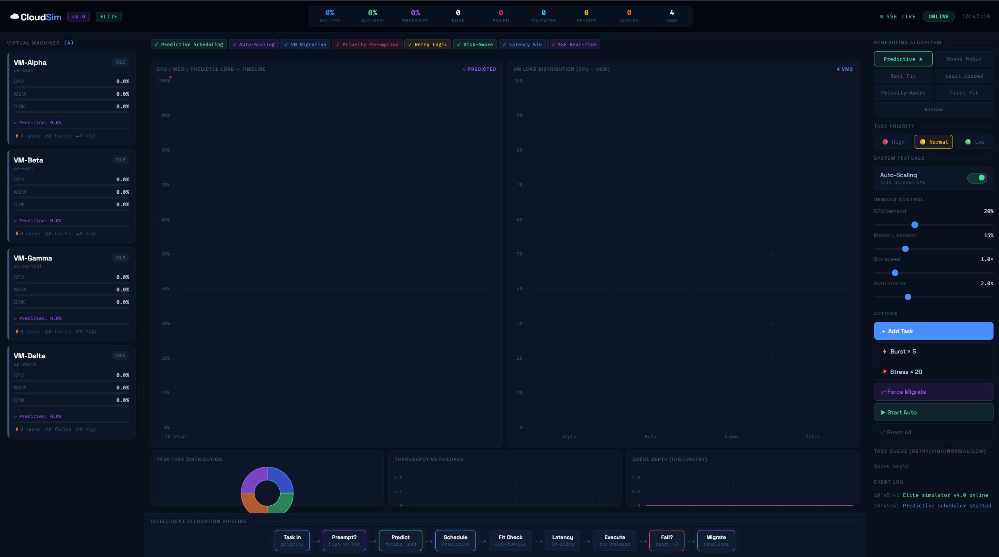
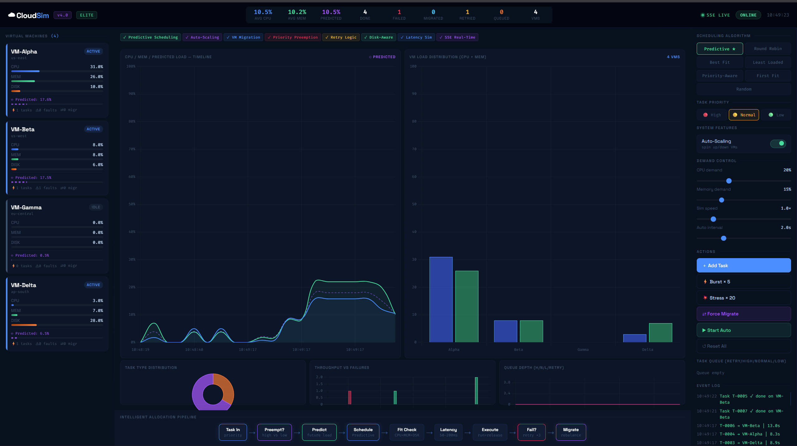
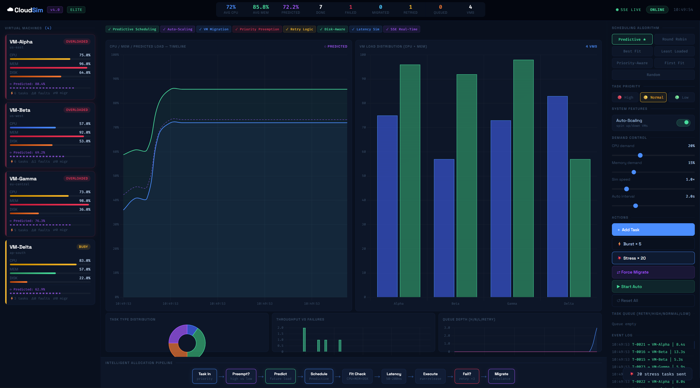
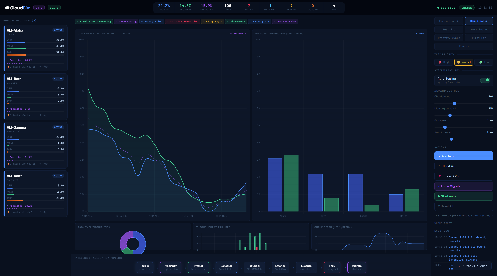
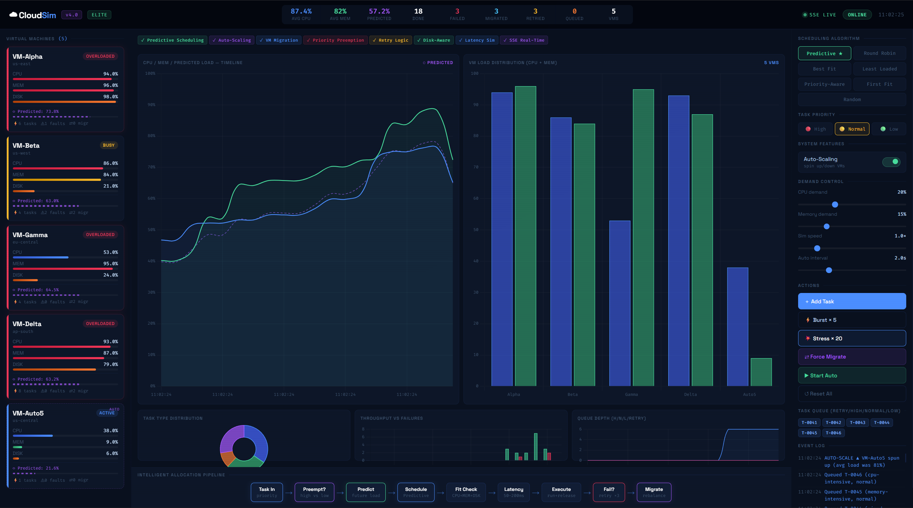

# ☁ Cloud Resource Allocation Simulator

> Simulate CPU and memory allocation in cloud computing environments, focusing on efficient workload distribution among virtual machines and optimizing resource usage under varying demand.

---

## Project Overview

This project simulates how cloud platforms allocate computing resources (CPU, memory, disk) across multiple Virtual Machines (VMs). It implements **5 scheduling algorithms**, real-time monitoring, task queuing, and a visual dashboard.

Description 

Adaptive cloud resource allocation simulator with multiple scheduling algorithms and real-time monitoring.

## Features

- **4 Virtual Machines** with CPU, Memory, and Disk tracking
- **5 Scheduling Algorithms**: Round Robin, Best Fit, Least Loaded, First Fit, Random
- **Real-time dashboard** with live charts (line, bar, donut, area)
- **Task queue** — tasks wait when no VM has capacity
- **Event log** with timestamped actions
- **Auto-spawn mode** with configurable interval
- **REST API backend** (Flask) + HTML/JS frontend
- **Burst mode** — spawn 5 tasks simultaneously

---


## 📊 System Behavior & Results

### Initial State

System starts with idle VMs and no workload.

---

### Burst Load

A sudden spike in tasks increases CPU and memory usage across all VMs.

---

### Round Robin Failure

Round Robin distributes tasks blindly, causing some VMs to become overloaded while others remain underutilised. This leads to queue buildup and higher failure rates.

---

### Predictive Scheduling Improvement

Predictive scheduling balances workload based on system state, reducing overload conditions and improving overall system stability.

---

### Auto Scaling

The system dynamically scales resources to handle increasing demand, preventing performance degradation.


## Technology Used

### Backend
| Tool | Purpose |
|------|---------|
| Python 3.10+ | Core language |
| Flask | REST API framework |
| Flask-CORS | Cross-origin support |
| Gunicorn | Production WSGI server |
| Threading | Concurrent task timers |

### Frontend
| Tool | Purpose |
|------|---------|
| HTML5 / CSS3 | Structure and styling |
| JavaScript (ES6+) | Dynamic rendering |
| Chart.js | Live charts |
| Google Fonts | Typography (JetBrains Mono, Syne) |

### Other Tools
| Tool | Purpose |
|------|---------|
| GitHub | Version control (7+ revisions) |
| GitHub Actions | CI pipeline |

---

## Module-Wise Breakdown

### Module 1 — VM Management (`app.py`)
Defines 4 VMs with CPU, memory, disk resources. Tracks running tasks and computes status (idle / active / busy / overloaded).

### Module 2 — Scheduling Algorithms (`app.py: pick_vm()`)
Five algorithms select the target VM for each task:
- **Round Robin** — rotates across VMs cyclically
- **Best Fit** — minimises wasted capacity
- **Least Loaded** — targets VM with lowest combined load
- **First Fit** — selects first VM with enough space
- **Random** — picks any eligible VM

### Module 3 — Task Lifecycle
Tasks arrive via API, are allocated to a VM, run for a random duration (3–10 seconds), then release their resources. Overflow tasks enter the queue and are dispatched when capacity opens.

### Module 4 — REST API (`/api/*`)
Flask endpoints expose state, receive commands, and stream metrics history for chart rendering.

### Module 5 — Frontend Dashboard (`index.html`)
Polls the API every 1.5 seconds. Renders VM cards, 4 live charts, queue, log, and controls.

---

## Functionalities

1. Add single tasks or bursts of 5
2. Switch scheduling algorithm at runtime
3. Adjust CPU/memory demand per task using sliders
4. Enable auto-spawn with configurable interval
5. View per-VM resource utilisation with colour-coded bars
6. Monitor allocation flow diagram
7. Track throughput, average utilisation, tasks done, queue depth
8. Reset simulation to initial state

---

## Flow Diagram

```
Task Arrives → Scheduler (Algorithm) → VM Available? 
                                           ├─ YES → Allocate (CPU+MEM+DISK) → Execute → Release → Drain Queue
                                           └─ NO  → Task Queue → Wait for slot
```

---

## Setup & Running

### 1. Clone repository
```bash
git clone https://github.com/YOUR_USERNAME/cloud-resource-allocation-simulator.git
cd cloud-resource-allocation-simulator
```

### 2. Start backend
```bash
cd backend
pip install -r requirements.txt
python app_v4.py
# API runs at http://localhost:5000
```

### 3. Open frontend
```bash
# Open frontend/index.html in a browser
# Or serve it:
cd frontend
python -m http.server 8080
# Visit http://localhost:8080
```

---

## API Endpoints

| Method | Endpoint | Description |
|--------|----------|-------------|
| GET  | `/api/state` | Full simulation state |
| POST | `/api/task` | Add a task `{cpu, mem, type}` |
| POST | `/api/task/burst` | Add multiple tasks `{count}` |
| POST | `/api/algo` | Set algorithm `{algo}` |
| POST | `/api/auto` | Toggle auto-spawn `{interval}` |
| POST | `/api/reset` | Reset simulation |
| GET  | `/api/metrics/history` | Chart history data |

---

## Scheduling Algorithm Comparison

| Algorithm | Best For | Weakness |
|-----------|----------|----------|
| Round Robin | Even distribution | Ignores current load |
| Best Fit | Maximising density | May overload one VM |
| Least Loaded | Balanced performance | Higher decision cost |
| First Fit | Speed | Poor distribution |
| Random | Testing/baseline | Unpredictable |

---

## Revision Tracking on GitHub

- Repository Name: `cloud-resource-allocation-simulator`
- GitHub Link: [Insert your GitHub link here]
- Minimum 7 revisions with clear commit messages
- Feature branches merged into `main` after testing

---

## Conclusion and Future Scope

This simulator demonstrates core cloud resource management concepts. Future improvements:
- Priority-based scheduling
- Multi-region latency simulation
- Auto-scaling (add/remove VMs)
- Persistent metrics with SQLite
- Docker containerisation

---

## References

1. Tanenbaum, A. S. — Modern Operating Systems (Resource Management)
2. Amazon AWS Documentation — EC2 Instance Types
3. Flask Documentation — https://flask.palletsprojects.com
4. Chart.js Documentation — https://www.chartjs.org
5. NIST Cloud Computing Definition — https://nvlpubs.nist.gov/nistpubs/Legacy/SP/nistspecialpublication800-145.pdf


